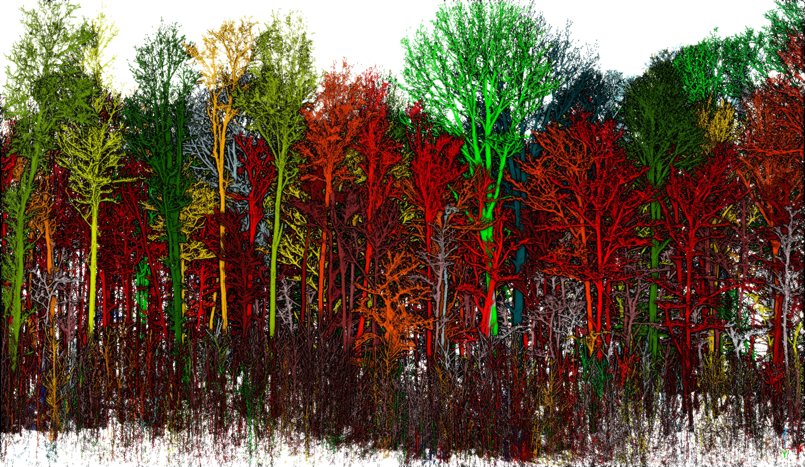
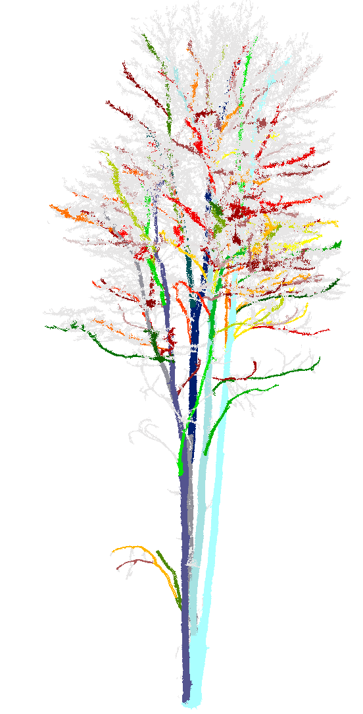

# FLiP.jl — Forest Lidar Processing

[](https://github.com/xiangtaoxu/FLiP.jl/actions)
[](https://codecov.io/gh/xiangtaoxu/FLiP.jl)
[](https://julialang.org/downloads/)

**FLiP.jl** is a high-performance Julia package that takes a raw forest LiDAR point cloud all the way to
**individually segmented trees** and **branch-level Quantitative Structure Models (QSM)** — ground separation,
above-ground height, per-tree instance segmentation, and per-branch DBH / volume / surface area — in a single
`run_pipeline` call. The entire workflow is **deterministic and graph-based** (Non-Branching Segments, radius and
quotient graphs, shortest-path slicing, frustum geometry): no random seeds, no training, fully reproducible runs.
Inner loops are **multi-threaded** for speed on large clouds.

## Results



*Side profile of a forest plot — every individual tree is segmented into a distinct color directly from the raw point cloud (instance segmentation across the whole plot).*



*A single tree resolved to branch level — each non-branching branch segment is colored separately over the gray raw cloud, the basis for per-branch QSM biometrics.*

## Why FLiP.jl

- **End-to-end pipeline** — one TOML config drives five stages (preprocess → ground + AGH → tree segmentation → QSM → report). Each stage writes its output to disk, so a run is **resumable from any stage**.
- **Deterministic & graph-based** — Non-Branching Segment (NBS) extraction, radius/quotient graphs, shortest-path slicing, and frustum geometry. No stochastic or learned components: the same input always yields the same trees.
- **From plot to branch** — individual-tree instance segmentation across a plot *and* per-branch structure within each tree, in the same run.
- **Branch-level QSM** — per-branch cross-section fitting (2D periodic surface smoothing) aggregated by frustum geometry into per-tree DBH, volume, and surface area, plus a generated surface point cloud.
- **Multi-threaded & memory-aware** — dynamically-scheduled parallel inner loops (statistical filter, NBS PCA, orphan KD-tree voting, per-component segmentation, per-tree QSM aggregation); index-based operations and per-stage cloud release + GC keep memory bounded on large clouds.
- **Formats** — read/write LAS, LAZ, and E57 with auto-dispatch by extension via `read_pc` / `write_pc`.

Under the hood: radius graphs, connected components, quotient graphs, and shortest-path slicing (Graphs.jl); Delaunay triangulation and cloud-to-mesh distance; and a full suite of point-cloud transformations — all exposed as building blocks (see [Advanced](#advanced--building-blocks)).

## Installation

> **Requirements:** Julia **v1.12 or newer**. FLiP.jl is built and tested against Julia ≥ 1.12; earlier versions are not supported.

```julia
using Pkg
Pkg.add("FLiP")
```

Or for development:

```julia
using Pkg
Pkg.develop(url="https://github.com/xiangtaoxu/FLiP.jl")
```

## Quick Start

Run the entire pipeline — raw cloud to branch-level QSM — from a single TOML config:

```julia
using FLiP

run_pipeline("flip_config.toml")   # raw cloud → ground / AGH → trees → branch QSM
```

To use multiple threads, launch Julia with `--threads` (and set `pipeline.n_thread` in the config):

```bash
julia --threads=auto --project=. -e 'using FLiP; run_pipeline("flip_config.toml")'
```

The pipeline writes, into `pipeline.output_dir`:

| Output | Contents |
| --- | --- |
| `{prefix}preprocess.{fmt}` | denoised / subsampled cloud |
| `{prefix}ground.{fmt}` | ground points |
| `{prefix}agh.{fmt}` | full cloud with per-point above-ground height (`:AGH`) |
| `{prefix}tree.{fmt}` | cloud annotated with `:tree_id`, `:tree_nbs_id`, `:nbs_id`, `:node_id` |
| `{prefix}skeleton.{fmt}` | per-NBS skeleton cloud (optional) |
| `{prefix}*_node.csv` | per-node biometrics (DBH, cross-section area, volume) |
| `{prefix}*_tree.csv` | per-tree aggregates (height, DBH, volume, surface area) |

Because every stage's output is on disk, you can disable upstream stages in the config and **resume** from a later one (e.g. re-run only QSM against an existing `tree` output).

A minimal config — the file mirrors the `FLiPConfig` struct one-to-one:

```toml
[pipeline]
input_path = "input.laz"
output_dir = "out/"
enable_qsm = true
n_thread   = -1            # all-but-one logical core (see Performance)

[qsm]
min_node_size  = 5
rho_percentile = 0.85
```

See [`flip_config.toml`](flip_config.toml) for the full annotated template, and [`demo.jl`](demo.jl) for a stage-by-stage walkthrough.

## Performance & Threading

FLiP.jl is built for large point clouds:

- **Multi-threaded inner loops** via dynamically-scheduled work-stealing — the statistical filter, NBS PCA labelling, orphan KD-tree voting, per-connected-component segmentation, and per-tree QSM aggregation all parallelize across the resolved thread budget.
- **Spatial indexing** with NearestNeighbors.jl KD-trees (built on 3×N transposed matrices), with batched KNN queries.
- **Pre-allocated workspace structs** for repeated graph operations (`ConnectedComponentSubsetWorkspace`, `ShortestPathSubsetWorkspace`, `GreedySearchWorkspace`).
- **Index-based, type-stable operations** throughout, plus per-stage cloud release + `GC.gc()` to bound peak memory.

Threading is controlled by `pipeline.n_thread` in the config:

| `n_thread` | Behavior |
| --- | --- |
| positive `N` | use `N` threads |
| `0` or `1` | serial (default) |
| negative | `Sys.CPU_THREADS + n_thread` (e.g. `-1` = all-but-one logical core) |

The value is always capped at `Threads.nthreads()`, so Julia must be launched with `--threads=N` (or `JULIA_NUM_THREADS=N`) for threading to take effect.

## Pipeline Configuration

`run_pipeline(config_path)` loads a TOML configuration and runs every enabled stage in execution order
(preprocess → ground segmentation → AGH → tree segmentation → QSM → report), writing intermediate clouds and CSVs
to `pipeline.output_dir`. With no argument it uses the package-default `flip_config.toml` at the repo root.

The config is a hierarchical wrapper with one section per stage (`[pipeline]`, `[preprocess]`,
`[statistical_filter]`, `[segment_ground]`, `[tree_segmentation]`, `[qsm]`); field names match the Julia struct
paths exactly, e.g. `qsm.min_node_size` (TOML) ↔ `cfg.qsm.min_node_size` (Julia). Reload at runtime with
`FLiP.load_config!("path/to/file.toml")`.

## Advanced — building blocks

For stage-by-stage control, every step is exported as a standalone function. Filter primitives return
`Vector{Int}` indices over an N×3 coordinate matrix — index back into the `PointCloud` to materialize a subset.

### I/O

```julia
pc   = read_pc("file.laz")              # auto-dispatch by extension (las/laz/e57)
write_pc("output.e57", pc)
meta = read_pc_metadata("file.laz")     # metadata without loading point data
# explicit forms also available: read_las/read_laz/read_e57, write_las/write_laz/write_e57
```

### Subsampling & filtering

```julia
coords = coordinates(pc)

pc_sub   = pc[distance_subsample(coords, 0.03)]                    # min-spacing subsample
pc_clean = pc_sub[statistical_filter(coordinates(pc_sub), 6, 1.0)] # outlier removal (k, n_sigma)
pc_keep  = pc[voxel_connected_component_filter(coords, 0.1; min_cc_size=10)]

# Ground filter chain (grid z-min seeds → upward conic)
seed_idx     = grid_zmin_filter(coords, 1.0)
ground_local = upward_conic_filter(coords[seed_idx, :], 45.0)
ground_idx   = seed_idx[ground_local]
```

### Transformations

```julia
pc2 = translate(pc, 10.0, 20.0, 5.0)
pc2 = rotate(pc, :z, π/4)                 # axis symbol or axis-angle vector
pc2 = scale(pc, 2.0)                      # uniform; or scale(pc, sx, sy, sz)
pc2 = bounding_box_crop(pc, [0,0,0], [10,10,10])

using CoordinateTransformations
pc2 = transform(pc, Translation(10,20,30) ∘ LinearMap(RotZ(π/4)))
```

### Stage-level calls

```julia
# Ground segmentation + above-ground height (IDW)
g = ground_segmentation(pc)
# g.ground_points / g.aboveground_height / g.agh_cloud / g.ground_area / g.agh_computed

# Tree segmentation (requires :AGH from ground_segmentation)
t = tree_segmentation(g.agh_cloud)
# t.pc_output (annotated with :tree_id, :tree_nbs_id, :nbs_id, :node_id, :AGH)
# t.filtered_cloud / t.skeleton_cloud / t.n_components / t.neighbor_radius
skeleton_pc = create_skeleton_cloud(t.pc_output)

# QSM (requires a tree-segmented cloud)
q = qsm(tree_result=t, output_dir="out/", output_prefix="demo_")
# q.pc_output (annotated with :qsm_node_id) / q.qsm_surface_cloud (:tree_nbs_id, :rho)
# q.node_csv_path / q.tree_csv_path
```

Lower-level helpers `segment_ground` and `calculate_aboveground_height` are also exported for custom pipelines.

### Data structure

The `PointCloud{T}` type stores 3D coordinates (N×3 `Float64` matrix, rows = points) and optional attributes:

```julia
pc = PointCloud(rand(Float64, 1000, 3))
pc = PointCloud(coords, Dict(:intensity => rand(1000), :label => rand(1:5, 1000)))

n        = npoints(pc)
coords   = coordinates(pc)
bbox     = bounds(pc)
centroid = center(pc)
subset   = pc[indices]      # index with an integer vector (preferred over Boolean masks)
```

## Dependencies

- [NearestNeighbors.jl](https://github.com/KristofferC/NearestNeighbors.jl) — spatial queries (KD-trees)
- [Graphs.jl](https://github.com/JuliaGraphs/Graphs.jl) — graph algorithms
- [DelaunayTriangulation.jl](https://github.com/DanielVandH/DelaunayTriangulation.jl) — mesh generation
- [MultivariateStats.jl](https://github.com/JuliaStats/MultivariateStats.jl) — PCA for linearity analysis
- [CoordinateTransformations.jl](https://github.com/JuliaGeometry/CoordinateTransformations.jl) / [Rotations.jl](https://github.com/JuliaGeometry/Rotations.jl) — geometric transforms
- [StaticArrays.jl](https://github.com/JuliaArrays/StaticArrays.jl) — efficient fixed-size arrays
- [PythonCall.jl](https://github.com/JuliaPy/PythonCall.jl) + CondaPkg — auto-managed Python env for LAS/LAZ I/O (`laspy` + `lazrs`) and E57 I/O (`pye57`)

## Contributing

Contributions are welcome! Please feel free to submit a Pull Request.

## License

This project is licensed under the MIT License — see the [LICENSE](LICENSE) file for details.

## Citation

If you use FLiP.jl in your research, please cite:

```bibtex
@software{flip_jl,
  author = {Xu, Xiangtao},
  title  = {FLiP.jl: Forest Lidar Processing in Julia},
  year   = {2026},
  url    = {https://github.com/xiangtaoxu/FLiP.jl}
}
```

## Related Projects

- [ForestLidarPackage](https://github.com/xiangtaoxu/ForestLidarPackage) — Python package for forest point cloud processing
- [CloudCompare](https://www.cloudcompare.org/) — 3D point cloud processing software
